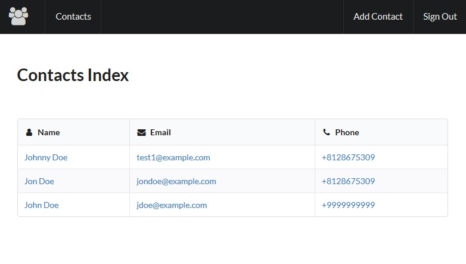
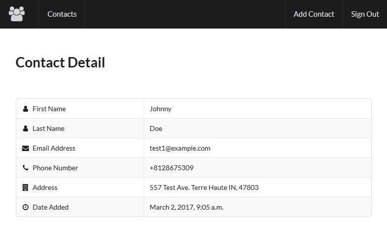
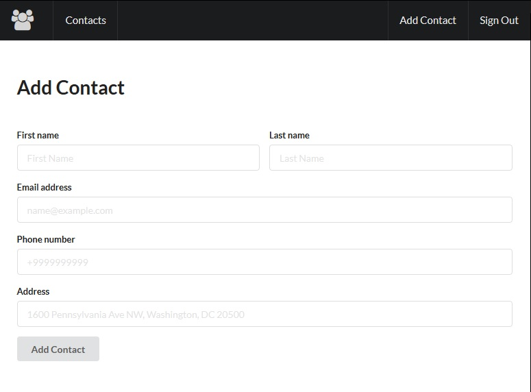

#Django Contacts
#### _Demo Project - Davis Nygren_

##Project Description
This is a demo contacts application built with Python 2.7, Django 1.8, and Semantic UI.

Current features include:
* Creating new contacts
* Viewing contacts
* Viewing a list of all contacts

##Requirements to Build
* Python 2.7
* Django 1.8

##Screenshots

